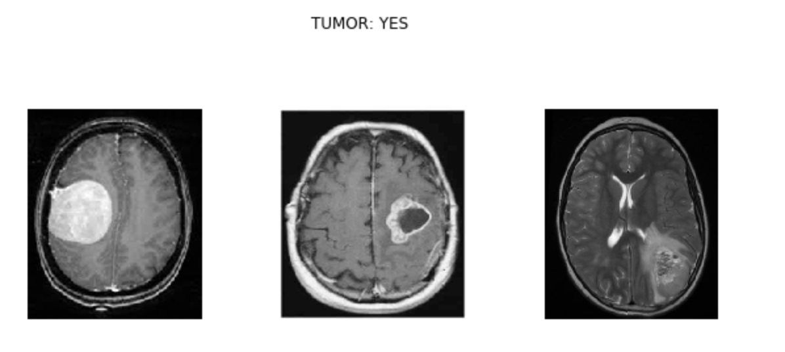
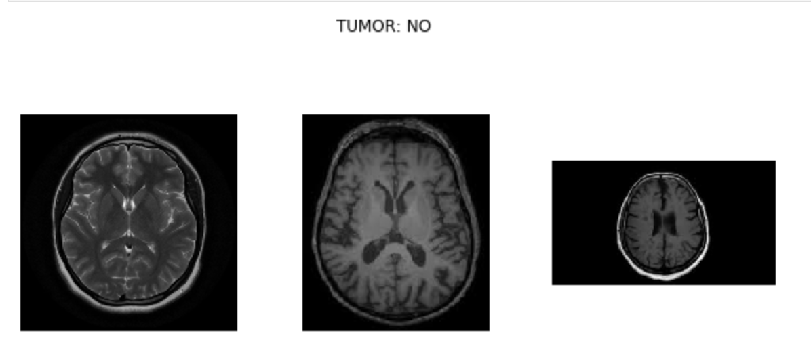
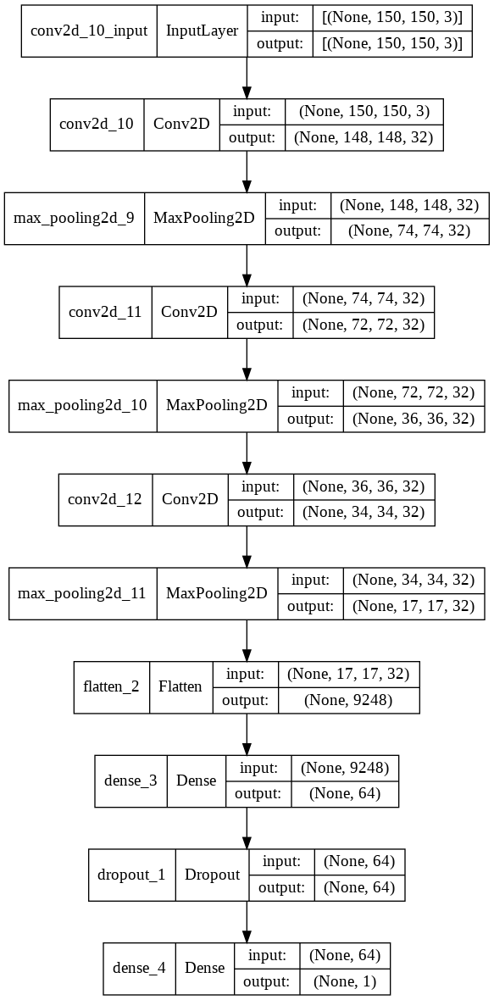
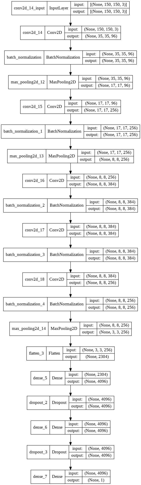
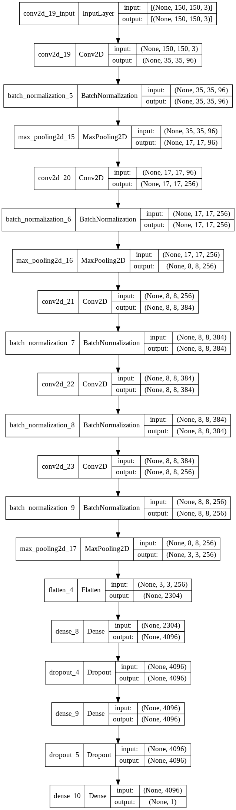
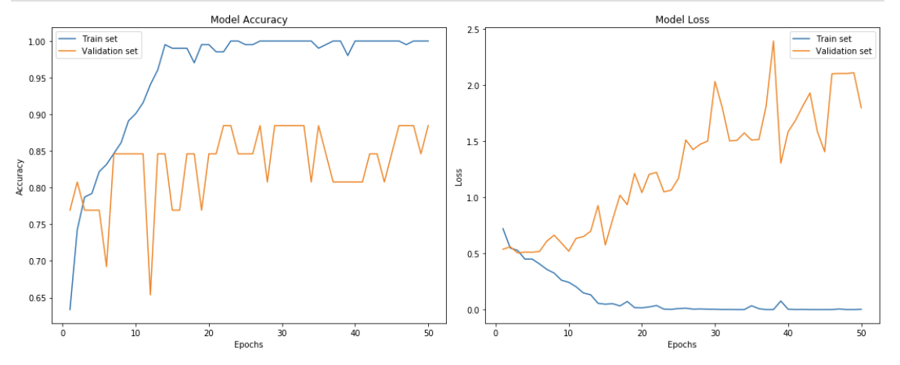
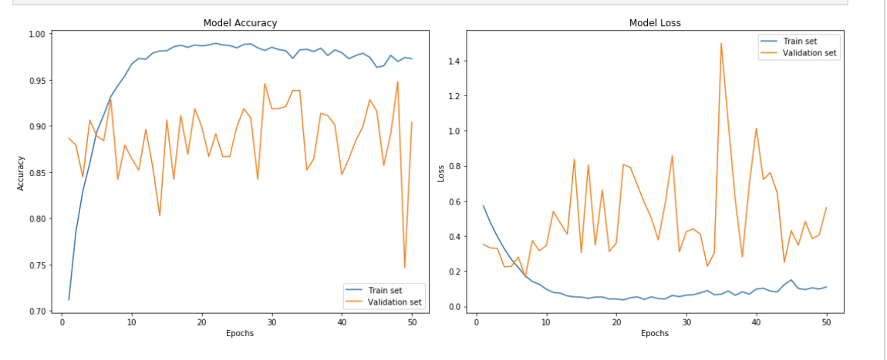
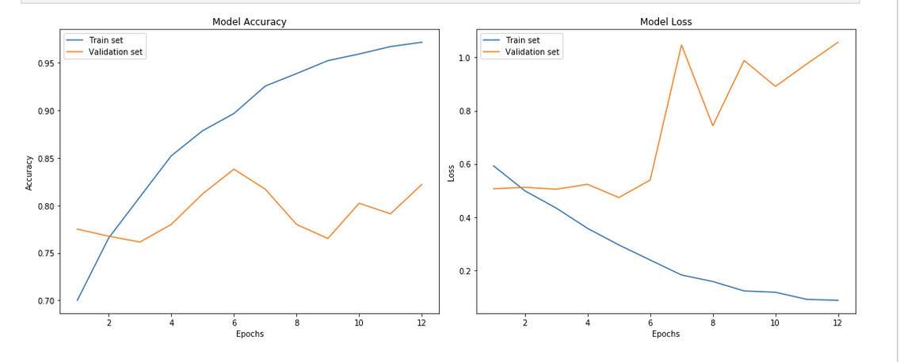
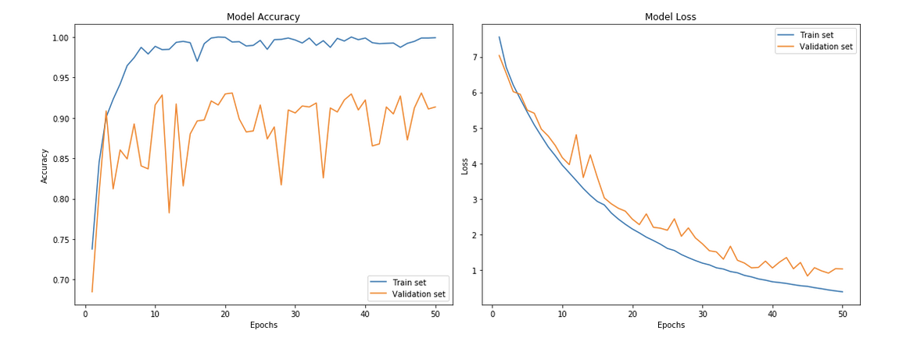

# BraiNN
Brain MRI Scan Classification (Tumor/No Tumor) project

## Introduction

The goal of this project is to classify an MRI scan of the brain in 2 classes: with tumor or without tumor. A brain tumor is a mass in the brain, which be detected in a scan.

Machine Learning has been widely used for the task of image classification. This is applicable in medicine as well, as medical imaging is used for diagnosis or monitoring the progression of a disease. The automation detection is achieved by using Convolutional Neural Networks (CNN). CNN is a type of deep neural network mostly applied to images.

## Dataset

The dataset used was the Brain MRI Images for Brain Tumor Detection (https://www.kaggle.com/navoneel/brain-mri-images-for-brain-tumor-detection).
There are 155 MRI images labelled 'yes' and 98 labelled 'no'.

The initial data was split as follows:

* 80% train
* 10% validation
* 10% test

Afterwards, I applied data augmentation, resulting in 2007 images labelled ‘yes’ and 2050 labelled ‘no’, and the proportions were modified:

* 60% train
* 20% validation
* 20% test

Below are 3 samples with a tumor and 3 samples without a tumor.




## Model

### Model 1



```
def brainModel():
    model = Sequential()
    model.add(Conv2D(32, (3,3), input_shape = (150, 150, 3)))
    model.add(Activation('relu'))
    model.add(MaxPooling2D(pool_size=(2,2)))
    
    model.add(Conv2D(32, (3,3)))
    model.add(Activation('relu'))
    model.add(MaxPooling2D(pool_size=(2,2)))
    
    model.add(Conv2D(32, (3,3)))
    model.add(Activation('relu'))
    model.add(MaxPooling2D(pool_size=(2,2)))
    
    # add the fully-connected layers
    model.add(Flatten())
    model.add(Dense(64))
    model.add(Activation('relu'))
    model.add(Dropout(0.5))
    model.add(Dense(1))
    model.add(Activation('sigmoid'))
    
    model.compile(loss = 'binary_crossentropy', optimizer = 'rmsprop', metrics = ['accuracy'])
    
    return model
```
### Model 2



```
def brainModel2():
    model = Sequential()
    model.add(Conv2D(96, kernel_size = (11, 11), strides = (4, 4), input_shape = (150, 150, 3)))
    model.add(Activation('relu'))
    model.add(BatchNormalization())
    model.add(MaxPooling2D(pool_size=(3, 3), strides = (2, 2)))
    
    model.add(Conv2D(256, kernel_size = (5, 5), strides = (1, 1), padding = "same"))
    model.add(Activation('relu'))
    model.add(BatchNormalization())
    model.add(MaxPooling2D(pool_size = (3, 3), strides = (2,2)))
    
    model.add(Conv2D(384, kernel_size = (3, 3), strides = (1, 1), padding = "same"))
    model.add(Activation('relu'))
    model.add(BatchNormalization())
    
    model.add(Conv2D(384, kernel_size = (1, 1), strides = (1, 1), padding = "same"))
    model.add(Activation('relu'))
    model.add(BatchNormalization())
    
    model.add(Conv2D(256, kernel_size = (1, 1), strides = (1, 1), padding = "same"))
    model.add(Activation('relu'))
    model.add(BatchNormalization())
    model.add(MaxPooling2D(pool_size = (3, 3), strides = (2,2)))
    
    # add the fully-connected layers
    model.add(Flatten())
    model.add(Dense(4096))
    model.add(Activation('relu'))
    model.add(Dropout(0.5))
    model.add(Dense(4096))
    model.add(Activation('relu'))
    model.add(Dropout(0.5))
    model.add(Dense(1))
    model.add(Activation('sigmoid'))
    
    model.compile(loss = 'binary_crossentropy', optimizer = 'SGD', metrics = ['accuracy'])
    
    return model
```

### Model 3



```
def brainModel3():
    model = Sequential()
    model.add(Conv2D(96, kernel_size = (11, 11), strides = (4, 4), input_shape = (150, 150, 3)))
    model.add(Activation('relu'))
    model.add(BatchNormalization())
    model.add(MaxPooling2D(pool_size=(3, 3), strides = (2, 2)))
    
    model.add(Conv2D(256, kernel_size = (5, 5), strides = (1, 1), padding = "same"))
    model.add(Activation('relu'))
    model.add(BatchNormalization())
    model.add(MaxPooling2D(pool_size = (3, 3), strides = (2,2)))
    
    model.add(Conv2D(384, kernel_size = (3, 3), strides = (1, 1), padding = "same", kernel_regularizer = tf.keras.regularizers.l2(l=0.01)))
    model.add(Activation('relu'))
    model.add(BatchNormalization())
    
    model.add(Conv2D(384, kernel_size = (1, 1), strides = (1, 1), padding = "same", kernel_regularizer = tf.keras.regularizers.l2(l=0.01)))
    model.add(Activation('relu'))
    model.add(BatchNormalization())
    
    model.add(Conv2D(256, kernel_size = (1, 1), strides = (1, 1), padding = "same"))
    model.add(Activation('relu'))
    model.add(BatchNormalization())
    model.add(MaxPooling2D(pool_size = (3, 3), strides = (2,2)))
    
    # add the fully-connected layers
    model.add(Flatten())
    model.add(Dense(4096))
    model.add(Activation('relu'))
    model.add(Dropout(0.5))
    model.add(Dense(4096))
    model.add(Activation('relu'))
    model.add(Dropout(0.5))
    model.add(Dense(1))
    model.add(Activation('sigmoid'))
    
    model.compile(loss = 'binary_crossentropy', optimizer = 'SGD', metrics = ['accuracy'])
    
    return model
```

## Training

### First iteration

The model was trained on 80% of the available data for 50 epochs and achieved a test accuracy of 92%.



It can be seen in the plot that the model is overfitting, as the training loss is decreasing, but the validation loss is increasing.

### Second iteration

In order to overcome overfitting, I used data augmentation. This can be achieved by using the ImageDataGenerator class from Keras. 
I have also solved the class imbalance problem (there are more images labelled ‘yes’ than images labelled ‘no ’), as I generated more images without a tumor than images with a tumor. 
This resulted in 2007 images labelled ‘yes’ and 2050 labelled ‘no’.

The model was trained on 80% of the available data for 50 epochs and achieved a test accuracy of 77%.



The training and validation loss are now closer on the plot. We will use early stopping, given that model2 is also overfitting. The training loss looks like a good fit, but the validation loss shows noisy movements in the plot. This means that the validation data is unrepresentative (does not provide sufficient information to evaluate the model).

### Third iteration

As the validation data is unrepresentative, in this iteration the data will be split in 60/20/20 and we will experiment with early stopping.

The test accuracy is 79% and the training stopped after 12 epochs.



### Last iteration

The last model (model3) was trained for 50 epochs and achieved 89% test accuracy.



## Conclusion

The dataset was small and it had class imbalance. This could be solved by data augmentation.

A model with 5 Convolutional layers which had a larger number of neurons performed better than a model with 3 Convolutional layers and less neurons in each layer. Regularization and normalization, together with data augmentation, solved the problem of overfitting.

In order to improve the performance, more data could be used. In this sense, this dataset could be augmented with more samples or other datasets with MRI brain scans could be added.

Another approach would be to use transfer learning. This consist of loading a pre-trained model and using its weights while training only some additional layers with the current dataset.

